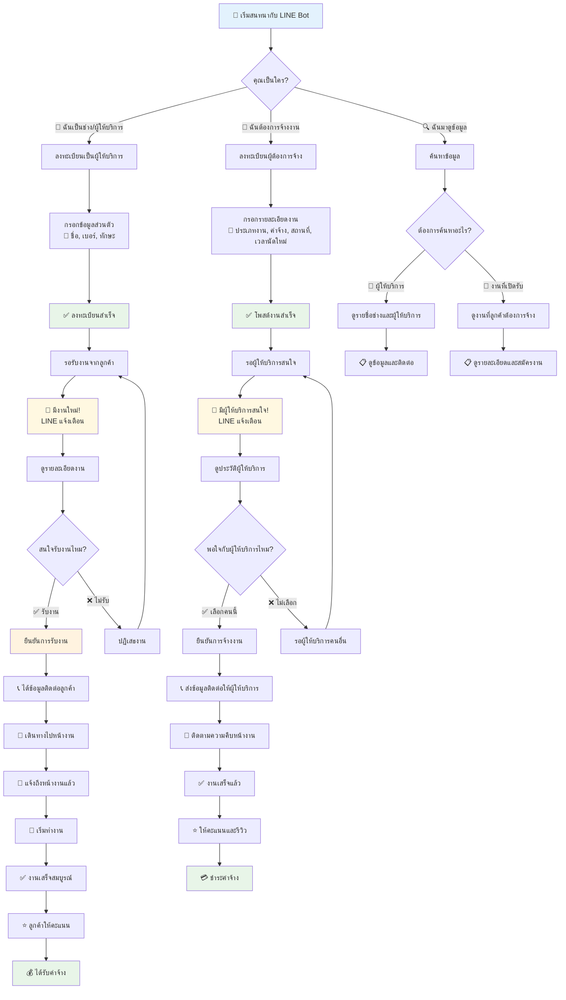
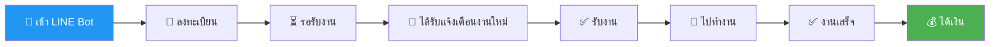
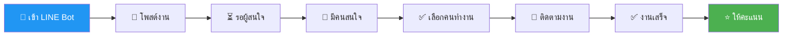
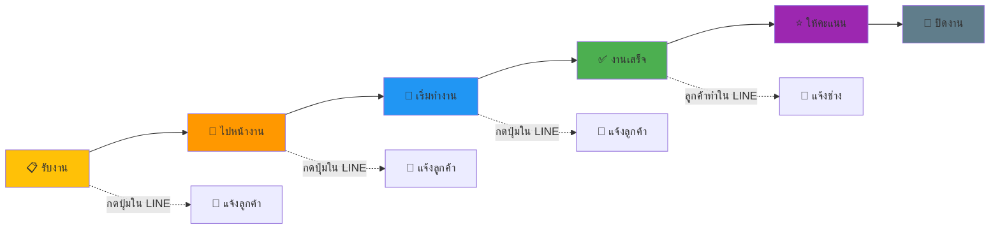

# JOB ชุมชน - แผนผังการใช้งาน LINE Bot (สำหรับผู้ใช้ทั่วไป)

## 🤖 การใช้งาน LINE Bot แบบง่ายๆ

## 📋 ขั้นตอนการใช้งานแบบง่าย

### 🔧 สำหรับผู้ให้บริการ (ช่าง/คนงาน)

### 👤 สำหรับผู้ต้องการจ้างงาน

## 💬 คำสั่งง่ายๆ ที่ใช้ใน LINE

### 📖 คำสั่งพื้นฐาน
- **"สวัสดี"** → เริ่มต้นใช้งาน
- **"ค้นหาช่าง"** → ดูรายชื่อช่างและผู้ให้บริการ
- **"ค้นหางาน"** → ดูงานที่เปิดรับสมัคร
- **"งานของฉัน"** → ดูงานที่กำลังทำอยู่
- **"ลงทะเบียน"** → สมัครเป็นสมาชิก
- **"ช่วยเหลือ"** → ดูวิธีใช้งาน

### 🎯 ปุ่มกดง่ายๆ
- 🔍 **ค้นหา** → หาข้อมูลที่ต้องการ
- ✅ **รับงาน** → ยืนยันรับงาน
- 📞 **ติดต่อ** → ดูข้อมูลติดต่อ
- 📍 **ถึงหน้างานแล้ว** → แจ้งเมื่อไปถึง
- 🔧 **เริ่มทำงาน** → แจ้งเมื่อเริ่มงาน
- ✅ **งานเสร็จ** → แจ้งเมื่องานเสร็จ

## 🎯 การติดตามความคืบหน้างาน

## 🌟 ประโยชน์ของระบบ

### 👷 สำหรับผู้ให้บริการ
- 🔔 **แจ้งเตือนงานใหม่** ทันทีใน LINE
- 📱 **รับงานง่าย** แค่กดปุ่ม
- 💰 **หางานเพิ่ม** ได้รายได้มากขึ้น
- ⭐ **สร้างชื่อเสียง** จากคะแนนลูกค้า

### 🏠 สำหรับผู้ต้องการจ้างงาน
- 🔍 **หาช่างง่าย** ในพื้นที่ใกล้บ้าน
- 👀 **ติดตามงาน** แบบเรียลไทม์
- ⭐ **ดูรีวิว** ก่อนตัดสินใจจ้าง
- 💸 **ประหยัดเวลา** ไม่ต้องหาช่างเอง

## 📞 ช่องทางการช่วยเหลือ

- 🤖 **LINE Bot**: พิมพ์ "ช่วยเหลือ" ใน LINE
- 📱 **เว็บไซต์**: jobcommunity.com
- 📧 **อีเมล**: support@jobcommunity.com
- ☎️ **โทรศัพท์**: 0X-XXX-XXXX

## ❓ คำถามที่พบบ่อย

**Q: การใช้งาน LINE Bot มีค่าใช้จ่ายไหม?**  
A: ไม่มีค่าใช้จ่าย ใช้งานฟรี 100%

**Q: ปลอดภัยไหม?**  
A: ปลอดภัย มีระบบตรวจสอบและการให้คะแนน

**Q: ถ้าไม่พอใจงานจะทำยังไง?**  
A: สามารถให้คะแนนและรีวิวได้ เพื่อช่วยคนอื่น

**Q: รับเงินยังไง?**  
A: ตกลงกับลูกค้าโดยตรง (เงินสด/โอนเงิน)

---

*🚀 เริ่มใช้งาน JOB ชุมชน วันนี้ - เชื่อมต่อผู้ให้บริการกับผู้ต้องการจ้างงาน*