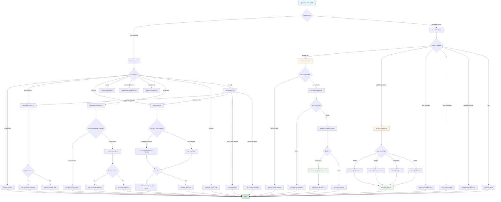
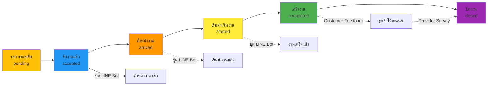
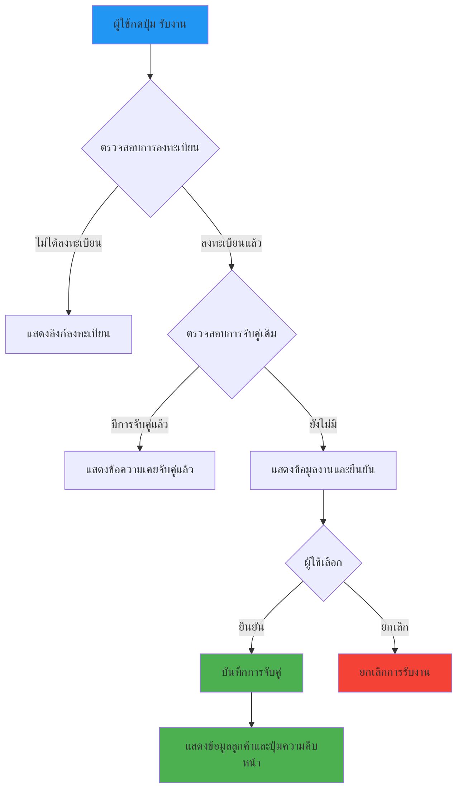

# LINE Bot Flowchart - JOB ชุมชน (Simplified)

## 📊 แผนผังการทำงานของ LINE Bot

## 🔄 5-Stage Job Progress Workflow

## 📋 Job Acceptance Flow

## 📱 LINE Bot Commands Reference

### คำสั่งหลัก (Main Commands)
- `สวัสดี` / `เริ่มต้น` / `start` → ข้อความต้อนรับ
- `ค้นหาผู้ให้บริการ` → แสดงรายชื่อผู้ให้บริการ
- `ค้นหางาน` → แสดงรายการงานที่ต้องการจ้าง
- `จับคู่งาน` → แสดงการจับคู่อัตโนมัติ
- `ดูงานของฉัน` / `งานของฉัน` → แสดงงานที่กำลังดำเนินการ
- `ลงทะเบียนผู้ให้บริการ` → ข้อมูลการลงทะเบียน
- `ลงทะเบียนงาน` → ข้อมูลการโพสต์งาน
- `ช่วยเหลือ` / `help` → คำแนะนำการใช้งาน

### คีย์เวิร์ด (Keywords)
- คำที่มี `ช่าง`, `บริการ` → ค้นหาผู้ให้บริการ
- คำที่มี `งาน`, `จ้าง` → ค้นหางาน
- คำที่มี `ติดต่อ`, `สอบถาม` → แสดงข้อมูลติดต่อ

### Postback Actions
- `accept_job` → รับงาน
- `update_progress` → อัพเดทความคืบหน้า
- `view_provider` → ดูรายละเอียดผู้ให้บริการ
- `view_customer` → ดูรายละเอียดลูกค้า
- `contact_provider` → ติดต่อผู้ให้บริการ
- `contact_customer` → ติดต่อลูกค้า
- `view_my_jobs` → ดูงานของฉัน

## 🎯 Key Features

1. **การจับคู่งานอัตโนมัติ**: ระบบจะกรองงานตามหมวดหมู่ของผู้ให้บริการ
2. **การรับงานผ่าน LINE**: ผู้ให้บริการสามารถรับงานได้ทันทีผ่าน LINE Bot
3. **การติดตามความคืบหน้า**: ระบบ 5 ขั้นตอนสำหรับติดตามงาน
4. **การตรวจสอบผู้ใช้**: ตรวจสอบการลงทะเบียนผ่าน LINE User ID
5. **Rich Menu & Quick Reply**: UI ที่ใช้งานง่ายและสะดวก
6. **Flex Messages**: ข้อความแบบ Interactive สำหรับแสดงข้อมูล

## 🔧 Technical Implementation

- **Message Handler**: จัดการข้อความ Text
- **Postback Handler**: จัดการการกดปุ่ม
- **API Integration**: เชื่อมต่อกับ Backend API
- **Progress Tracking**: ระบบติดตามความคืบหน้างาน 5 ขั้นตอน
- **User Verification**: ตรวจสอบผู้ใช้ผ่าน LINE ID
- **Rich Templates**: Carousel, Flex Message, Quick Reply

---

*Generated by JOB ชุมชน Platform*