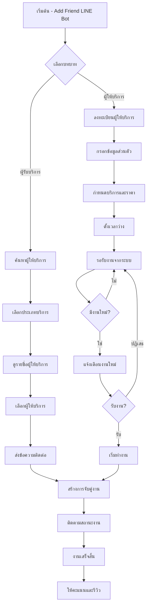
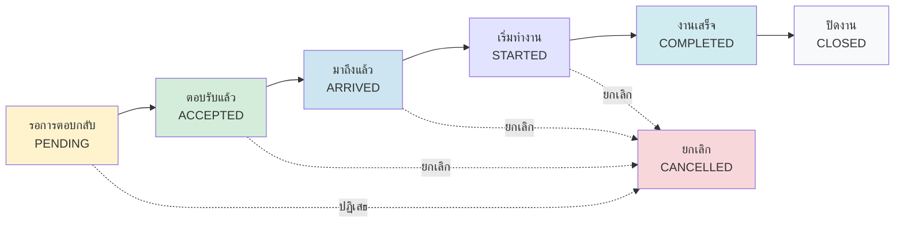

# ราชบุรีงานชุมชน - Community Job Matching Platform
## งานนำเสนอสำหรับชุมชน

---

## สไลด์ 1: หน้าปก (Cover Slide)
### ราชบุรีงานชุมชน
**แพลตฟอร์มเชื่อมต่อผู้ให้บริการกับผู้รับบริการในชุมชน**

- 📱 ใช้งานง่าย ผ่าน Web และ LINE
- 🤝 เชื่อมต่อคนในชุมชนเดียวกัน
- ⚡ รวดเร็ว ปลอดภัย เชื่อถือได้
- 🌟 สร้างโอกาสรายได้ให้ชุมชน

**ศูนย์จัดการแรงงานระดับพื้นที่ตำบลแพงพวย**  
**อำเภอดำเนินสะดวก จังหวัดราชบุรี**

---

## สไลด์ 2: ปัญหาที่เราแก้ไข (Problem Statement)
### ปัญหาในชุมชนปัจจุบัน

**ผู้ที่ต้องการจ้างงาน:**
- 🔍 หาคนทำงานยาก ไม่รู้จะติดต่อใคร
- 📞 พึ่งพาการบอกต่อ หรือการโทรหาเท่านั้น
- ⏰ เสียเวลาในการค้นหาและติดต่อ
- 💰 ไม่รู้ราคามาตรฐาน อาจโดนเอารัดเอาเปรียบ

**ผู้ที่ต้องการหางาน:**
- 👂 รอฟังข่าวจากคนรู้จักเท่านั้น
- 📱 ไม่มีช่องทางประชาสัมพันธ์ตัวเอง
- 🎯 ไม่สามารถเข้าถึงลูกค้าใหม่ได้
- 💼 รายได้ไม่สม่ำเสมอ

**→ เราสร้างแพลตฟอร์มเพื่อแก้ปัญหานี้!**

---

## สไลด์ 3: โซลูชั่นของเรา (Our Solution)
### ราชบุรีงานชุมชน คือคำตอบ

**🌐 เว็บแอปพลิเคชัน**
- ค้นหาผู้ให้บริการตามประเภทงาน
- ดูรายละเอียด ราคา และรีวิว
- ติดต่อโดยตรงผ่านระบบ

**💬 LINE Chatbot**
- ใช้งานผ่าน LINE ที่คุ้นเคย
- ค้นหาและจับคู่งานอัตโนมัติ
- แจ้งเตือนเมื่อมีงานใหม่

**🤖 ระบบจับคู่อัจฉริยะ**
- วิเคราะห์พื้นที่, ราคา, และเวลา
- แนะนำงานที่เหมาะสมที่สุด
- ช่วยลดเวลาในการค้นหา

---

## สไลด์ 4: การเดินทางของผู้รับบริการ (Customer Journey)
### ขั้นตอนการใช้งานสำหรับผู้ที่ต้องการจ้างงาน

**1️⃣ ค้นหาและเลือก**
```
เข้าเว็บ/LINE → เลือกประเภทงาน → ดูรายชื่อผู้ให้บริการ
```

**2️⃣ ดูรายละเอียด**
```
ดูโปรไฟล์ → เช็คราคา/เวลา → อ่านรีวิว → เปรียบเทียบ
```

**3️⃣ ติดต่อและจอง**
```
กดติดต่อ → กรอกรายละเอียดงาน → นัดหมายวันเวลา
```

**4️⃣ รับบริการ**
```
ผู้ให้บริการมาทำงาน → ตรวจสอบผลงาน → ชำระเงิน
```

**5️⃣ ให้คะแนน**
```
ให้คะแนนและรีวิว → ช่วยชุมชนมีข้อมูลที่ดี
```

---

## สไลด์ 5: การเดินทางของผู้ให้บริการ (Provider Journey)
### ขั้นตอนการใช้งานสำหรับผู้ที่ต้องการหางาน

**1️⃣ ลงทะเบียน**
```
เข้าเว็บ/LINE → กดลงทะเบียน → กรอกข้อมูลส่วนตัว
```

**2️⃣ สร้างโปรไฟล์**
```
เพิ่มรูปภาพ → เขียนแนะนำตัว → กำหนดราคา/เวลาว่าง
```

**3️⃣ รับการจับคู่**
```
ระบบแจ้งเตือนงานใหม่ → เลือกรับ/ปฏิเสธงาน
```

**4️⃣ ทำงาน**
```
นัดหมายลูกค้า → ไปทำงานตามเวลา → ทำงานให้เสร็จสมบูรณ์
```

**5️⃣ รับชำระและรีวิว**
```
รับเงิน → รับรีวิวจากลูกค้า → สร้างชื่อเสียงในชุมชน
```

---

## สไลด์ 6: โฟลว์ชาร์ท LINE Chatbot
### ขั้นตอนการใช้งาน LINE Chatbot



---

## สไลด์ 7: โฟลว์ชาร์ทขั้นตอนงาน (Job Stages Flow)
### 5 ขั้นตอนการทำงาน



**ขั้นตอนการทำงาน:**
- 🟡 **รอการตอบกลับ**: ผู้ให้บริการพิจารณางาน
- 🟢 **ตอบรับแล้ว**: ยืนยันรับงาน, กำหนดวันเวลา
- 🔵 **มาถึงแล้ว**: ผู้ให้บริการมาถึงสถานที่แล้ว
- 🟣 **เริ่มทำงาน**: กำลังดำเนินการทำงาน
- 🟦 **งานเสร็จ**: ทำงานเสร็จเรียบร้อย
- ⚪ **ปิดงาน**: ชำระเงิน, ให้คะแนนเสร็จสิ้น

---

## สไลด์ 8: คุณสมบัติเด่น (Key Features)
### สิ่งที่ทำให้เราพิเศษ

**🎯 การจับคู่อัจฉริยะ**
- วิเคราะห์พื้นที่ (อำเภอ/ตำบล)
- เปรียบเทียบราคาและงบประมาณ
- จับคู่เวลาว่างกับความต้องการ

**📱 ใช้งานง่าย 2 ช่องทาง**
- เว็บแอป: ดูข้อมูลรายละเอียดครบถ้วน
- LINE Bot: สะดวก รวดเร็ว คุ้นเคย

**🔒 ปลอดภัยและเชื่อถือได้**
- ระบบรีวิวและให้คะแนน
- เก็บประวัติการทำงาน
- แจ้งเตือนการทำงานผ่าน LINE

**📊 ระบบจัดการสำหรับแอดมิน**
- ติดตามสถิติการใช้งาน
- จัดการหมวดหมู่บริการ
- รายงานผลการดำเนินงาน

---

## สไลด์ 9: ประโยชน์ที่ได้รับ (Benefits)
### เราช่วยให้ชุมชนเข้มแข็ง

**👥 สำหรับชุมชน**
- ลดการว่างงานในชุมชน
- เพิ่มโอกาสรายได้ให้คนในพื้นที่
- สร้างเครือข่ายความช่วยเหลือ
- ข้อมูลโปร่งใส เชื่อถือได้

**💰 สำหรับผู้ให้บริการ**
- หารายได้เพิ่ม จากฝีมือที่มี
- เข้าถึงลูกค้าใหม่ๆ ได้ง่าย
- สร้างชื่อเสียงจากรีวิวที่ดี
- จัดการเวลาทำงานได้อิสระ

**🏠 สำหรับผู้รับบริการ**
- ประหยัดเวลาในการหาคนทำงาน
- มั่นใจในคุณภาพจากรีวิว
- ราคายุติธรรม โปร่งใส
- ติดต่อสะดวก ปลอดภัย

---

## สไลด์ 10: วิธีเริ่มต้นใช้งาน (How to Get Started)
### เริ่มใช้งานได้ง่าย ๆ ในวันนี้!

**📱 LINE Chatbot**
1. สแกน QR Code หรือเข้าลิงค์: `https://lin.ee/9G2yLV0`
2. กดเมนู "ลงทะเบียน"
3. เลือกบทบาท: ผู้ให้บริการ หรือ ผู้รับบริการ
4. กรอกข้อมูล และเริ่มใช้งานได้เลย!


**🌐 เว็บแอปพลิเคชัน**
1. เข้าเว็บไซต์: `ratchaburicommunity.co.th`
2. กดปุ่ม "ลงทะเบียน"
3. กรอกข้อมูลส่วนตัว
4. เริ่มค้นหา หรือ ให้บริการได้ทันที!

**📞 ติดต่อสอบถาม**
- **โทรศัพท์**: 0X-XXX-XXXX
- **อีเมล**: support@ratchaburicommunity.co.th
- **ที่อยู่**: ศูนย์จัดการแรงงานระดับพื้นที่ตำบลแพงพวย

**🎉 ขอบคุณที่ร่วมสร้างชุมชนที่เข้มแข็ง!**