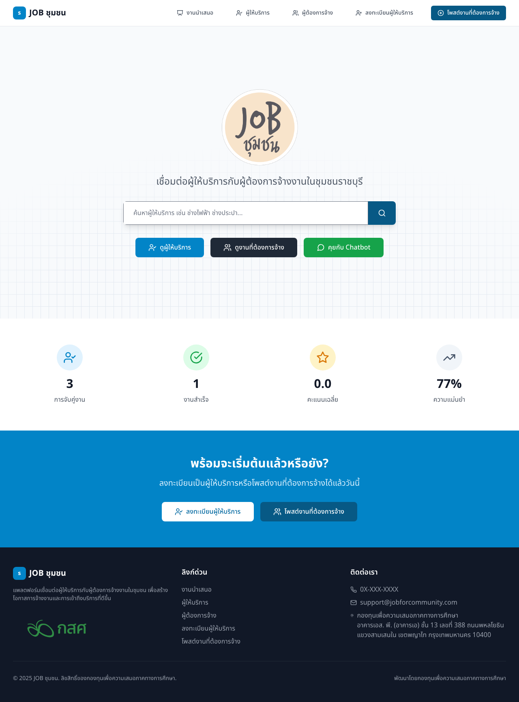
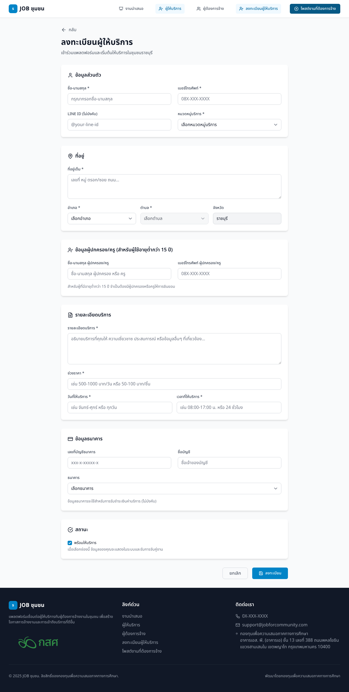
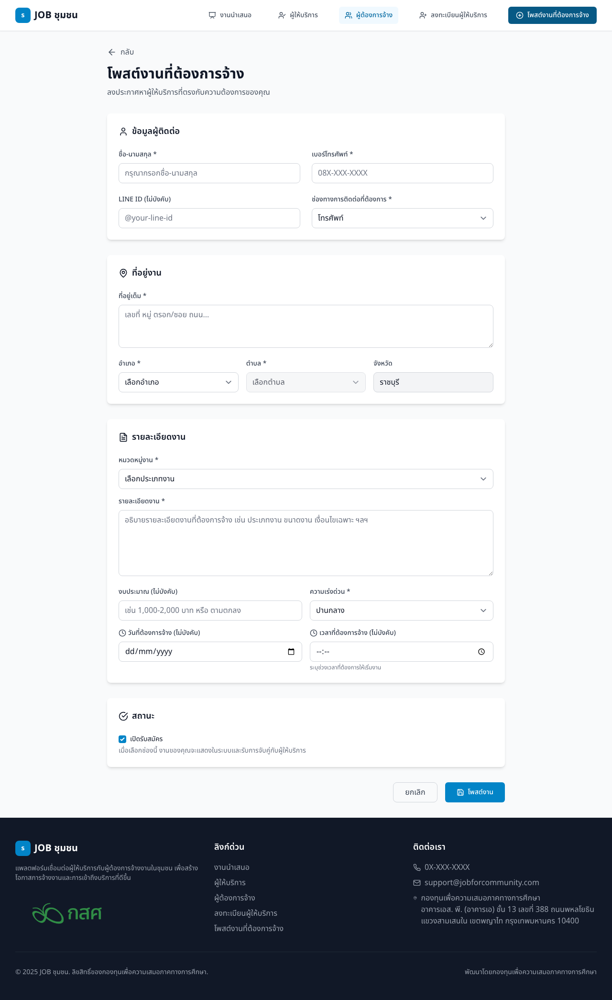
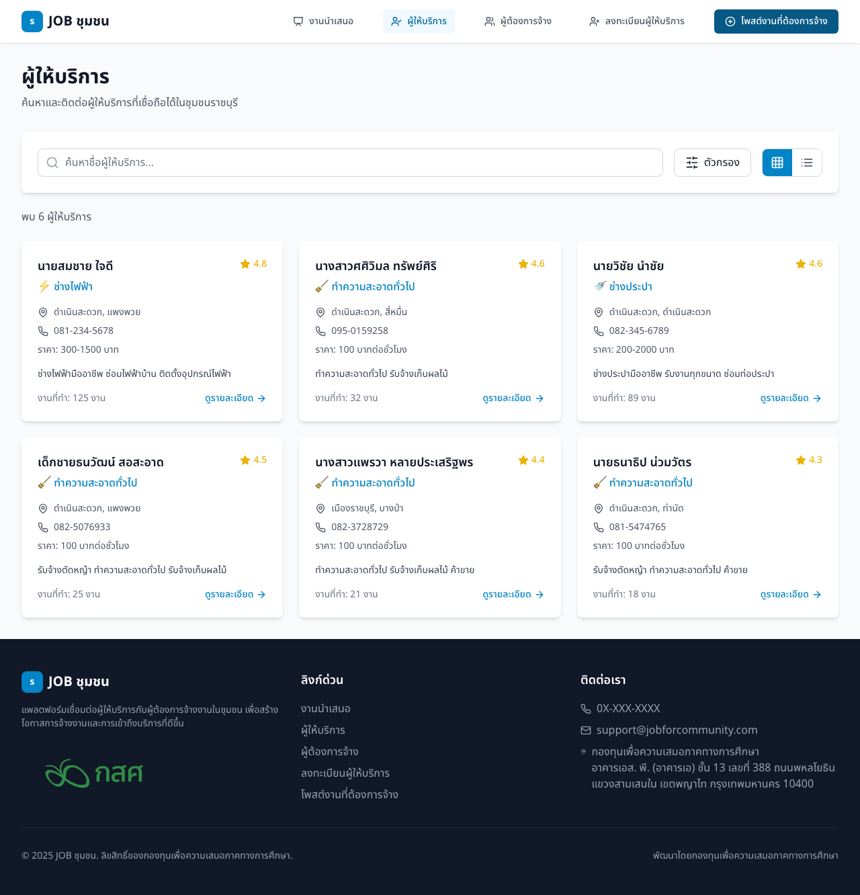
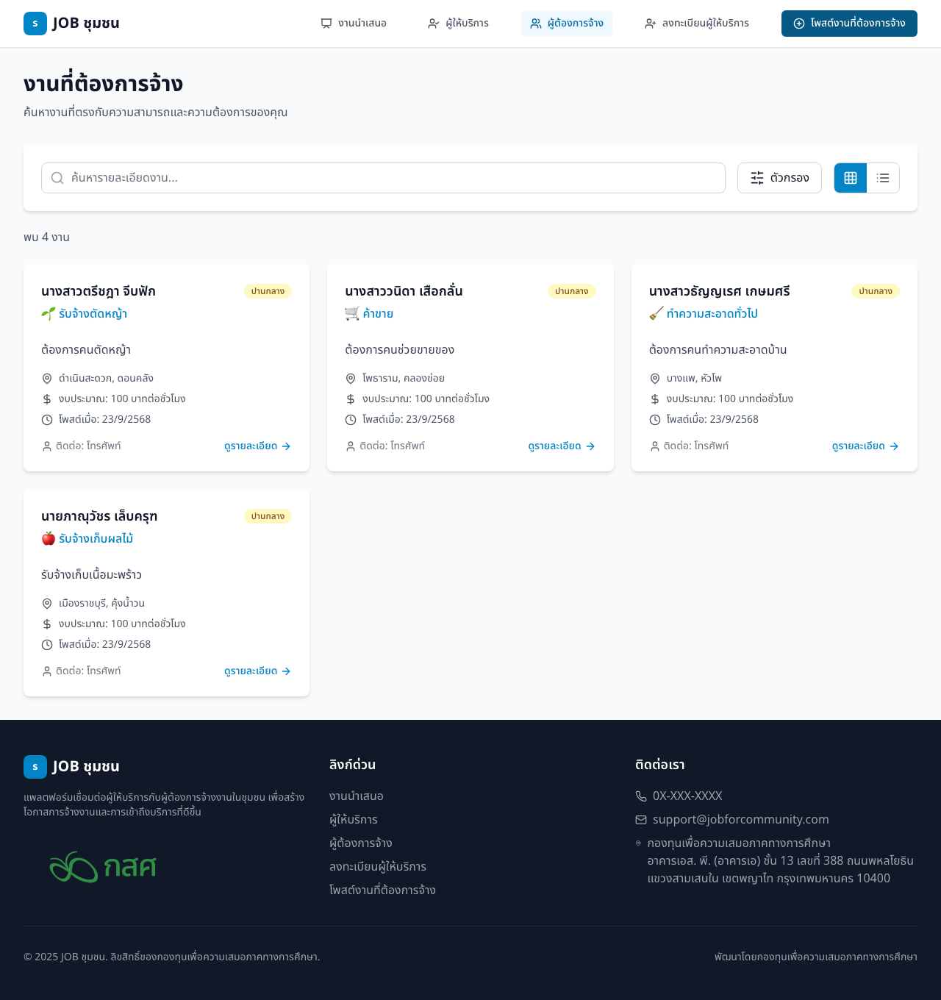
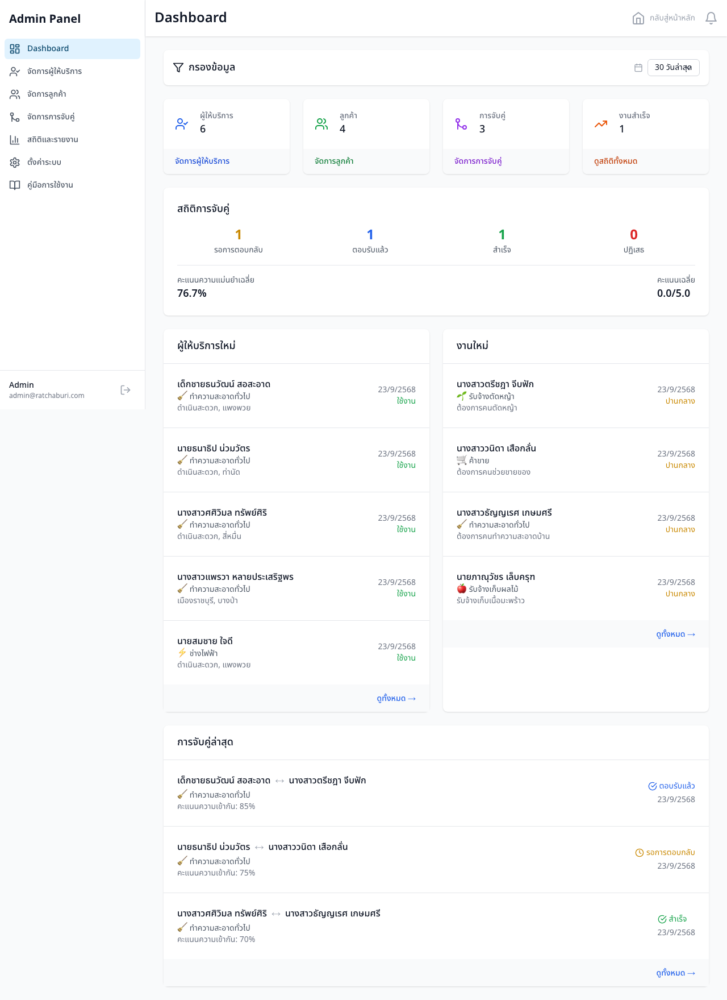
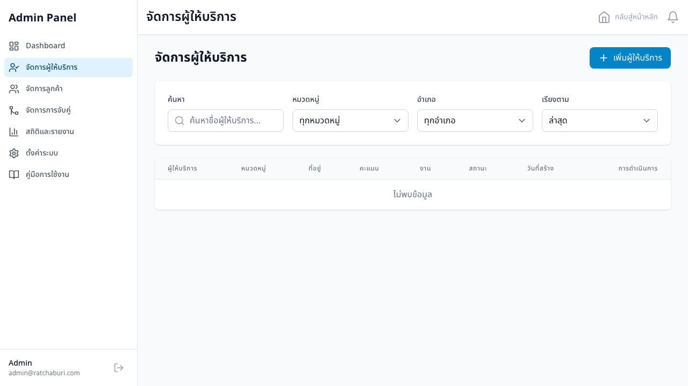
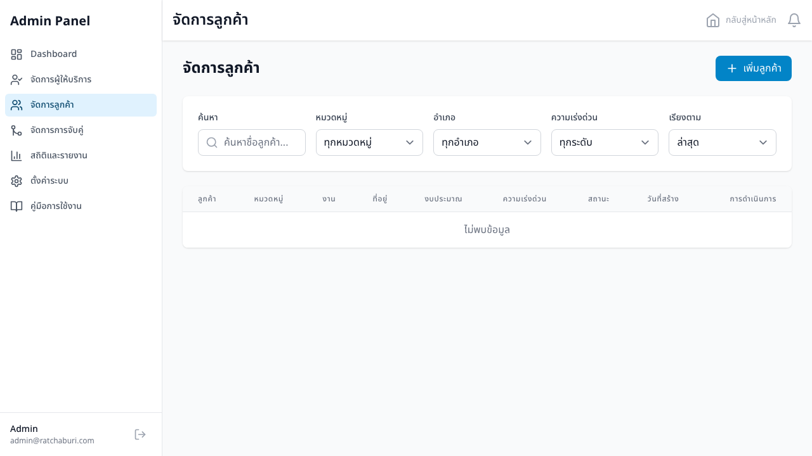
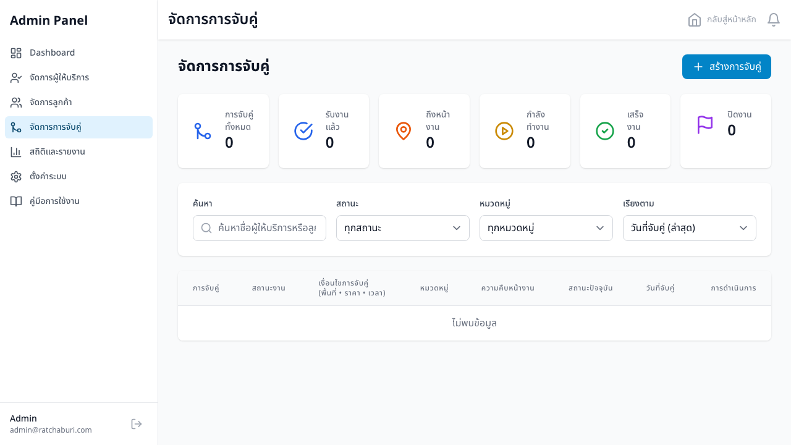

# คู่มือการใช้งาน JOB ชุมชน - ราชบุรี

## ภาพรวม
แพลตฟอร์ม JOB ชุมชน เป็นระบบจับคู่งานที่เชื่อมต่อผู้ให้บริการกับผู้ต้องการจ้างงานในชุมชนจังหวัดราชบุรี มีทั้ง Web Application และ LINE Chatbot

## คู่มือแยกตามกลุ่มผู้ใช้

### 📋 [คู่มือผู้ให้บริการ](./คู่มือผู้ให้บริการ.md)
สำหรับผู้ที่ต้องการลงทะเบียนเป็นผู้ให้บริการ ครอบคลุม:
- การลงทะเบียนและสร้างโปรไฟล์
- การรับงานและจัดการสถานะ
- การใช้งานผ่าน Web และ LINE Chatbot
- การสร้างความน่าเชื่อถือและรับรีวิว

### 💼 [คู่มือผู้ใช้บริการ](./คู่มือผู้ใช้บริการ.md)
สำหรับผู้ที่ต้องการจ้างงาน ครอบคลุม:
- การค้นหาและเลือกผู้ให้บริการ
- การโพสต์งานและจัดการรายการ
- การติดตามสถานะและการจับคู่
- การให้คะแนนและรีวิว

### ⚙️ [คู่มือผู้ดูแลระบบ (Admin)](#คู่มือผู้ดูแลระบบ-admin)
สำหรับผู้ดูแลระบบและเจ้าหน้าที่ ครอบคลุม:
- การเข้าถึงระบบจัดการ
- การจัดการผู้ให้บริการและผู้ใช้บริการ
- การติดตามสถิติและรายงาน
- การจัดการประเภทบริการและการจับคู่

## ช่องทางการใช้งาน

### 🌐 Web Application
**URL**: [https://ratchaburi-community-jobs.vercel.app](https://ratchaburi-community-jobs.vercel.app)

**คุณสมบัติหลัก**:
- ดูรายการผู้ให้บริการและงาน
- ลงทะเบียนและจัดการโปรไฟล์
- ระบบค้นหาและกรองข้อมูล
- ติดตามสถานะงานแบบ real-time

### 💬 LINE Chatbot
**LINE ID**: `@ratchaburi_community`

**คุณสมบัติหลัก**:
- การสนทนาแบบ interactive
- Rich Menu สำหรับการนำทาง
- การแจ้งเตือนทันที
- ระบบลงทะเบียนแบบ step-by-step

## Screenshots ประกอบ

### หน้าแรกเว็บไซต์

### หน้าลงทะเบียนผู้ให้บริการ

### หน้าลงทะเบียนผู้ใช้บริการ

### รายการผู้ให้บริการ

### รายการงานที่ต้องการจ้าง

### การจับคู่งาน

### หน้าดูแลระบบ

## คุณสมบัติเด่น

### 🎯 การจับคู่งานอัจฉริยะ
- จับคู่โดยพิจารณาประเภทงาน พื้นที่ และเวลา
- ให้คะแนนความเหมาะสมแต่ละคู่
- แนะนำผู้ให้บริการที่มีคะแนนดี

### 📱 Multi-Platform
- ใช้งานได้ทั้ง Web และ LINE
- ข้อมูลซิงค์กันระหว่างแพลตฟอร์ม
- การแจ้งเตือนแบบ real-time

### 🔒 ความปลอดภัย
- ระบบยืนยันตัวตนผ่านเบอร์โทร
- ข้อมูลผู้ปกครองสำหรับผู้เยาว์
- การป้องกันข้อมูลส่วนบุคคล

### ⭐ ระบบคะแนนและรีวิว
- ให้คะแนนได้หลายด้าน
- รีวิวจากผู้ใช้จริง
- สร้างความน่าเชื่อถือ

## การติดต่อและสนับสนุน

### 📞 ช่องทางติดต่อ
- **LINE Official**: @ratchaburi_community
- **โทรศัพท์**: 0X-XXX-XXXX
- **อีเมล**: support@ratchaburicommunity.co.th

### 🏢 สำนักงาน
**ศูนย์จัดการแรงงานระดับพื้นที่ตำบลแพงพวย**  
อำเภอดำเนินสะดวก จังหวัดราชบุรี

## อัปเดตล่าสุด
- ✅ เพิ่มฟีลด์ผู้ปกครองสำหรับผู้เยาว์
- ✅ ปรับปรุง UI หน้าแรกด้วย logo และ background ใหม่
- ✅ เพิ่มระบบ placeholder เมื่อไม่มีข้อมูล
- ✅ สร้างคู่มือการใช้งานฉบับสมบูรณ์

---

*คู่มือฉบับนี้อัปเดตล่าสุด: ธันวาคม 2024*

## ข้อมูลเทคนิค

### สำหรับนักพัฒนา
- **Frontend**: Next.js, React, TypeScript, Tailwind CSS
- **Backend**: Node.js, Express, SQLite
- **Chatbot**: LINE Messaging API
- **Deployment**: Vercel (Frontend), Render (Backend)

### การติดตั้งสำหรับการพัฒนา
ดูรายละเอียดใน [CLAUDE.md](../CLAUDE.md) หรือ [README.md](../README.md) หลัก

---

## คู่มือผู้ดูแลระบบ (Admin)

### 🔐 การเข้าถึงระบบจัดการ

#### เข้าใช้งานระบบ Admin
**URL**: [https://ratchaburi-community-jobs.vercel.app/admin](https://ratchaburi-community-jobs.vercel.app/admin)

### 📊 หน้าแดชบอร์ด (Dashboard)

หน้าแดชบอร์ดแสดงภาพรวมของระบบ ประกอบด้วย:

#### สถิติหลัก
- **จำนวนผู้ให้บริการทั้งหมด** - รวมทั้งที่ active และ inactive
- **จำนวนผู้ใช้บริการทั้งหมด** - รวมงานที่โพสต์แล้ว
- **จำนวนการจับคู่งาน** - ทั้งที่สำเร็จและกำลังดำเนินการ
- **อัตราความสำเร็จ** - เปอร์เซ็นต์งานที่เสร็จสมบูรณ์

#### กราฟและแผนภูมิ
- แผนภูมิการเติบโตของผู้ใช้รายเดือน
- สถิติการจับคู่งานรายประเภท
- อัตราความสำเร็จของงานแต่ละหมวด

### 👥 การจัดการผู้ให้บริการ

#### ฟีเจอร์การจัดการ
- **ดูรายการผู้ให้บริการทั้งหมด** พร้อมข้อมูลโดยสรุป
- **ค้นหาและกรองข้อมูล** ตามชื่อ, ประเภทบริการ, พื้นที่
- **ดูรายละเอียดโปรไฟล์** ครบถ้วน
- **อนุมัติ/ปฏิเสธ** การลงทะเบียนใหม่
- **ระงับ/เปิดใช้งาน** บัญชีผู้ให้บริการ
- **แก้ไขข้อมูล** ที่จำเป็น
- **ดูประวัติการทำงาน** และคะแนนรีวิว

#### การดำเนินการ
1. **อนุมัติผู้ให้บริการใหม่**
   - ตรวจสอบข้อมูลความถูกต้อง
   - ยืนยันข้อมูลผู้ปกครอง (ถ้าอายุต่ำกว่า 15 ปี)
   - อนุมัติหรือขอข้อมูลเพิ่มเติม

2. **จัดการปัญหา**
   - ตรวจสอบข้อร้องเรียน
   - ระงับบัญชีผู้ให้บริการที่มีปัญหา
   - ติดต่อประสานงานแก้ไขปัญหา

### 💼 การจัดการผู้ใช้บริการ

#### ฟีเจอร์การจัดการ
- **ดูรายการผู้ใช้บริการ** และงานที่โพสต์
- **ตรวจสอบงานที่ต้องการจ้าง** ความเหมาะสม
- **จัดการงานที่ไม่เหมาะสม** หรือขัดต่อนโยบาย
- **ติดตามสถานะงาน** แต่ละรายการ
- **แก้ไขข้อมูลงาน** ที่จำเป็น

#### การควบคุมคุณภาพ
1. **ตรวจสอบเนื้อหางาน**
   - ไม่มีเนื้อหาที่ไม่เหมาะสม
   - ราคาและเงื่อนไขสมเหตุสมผล
   - ข้อมูลครบถ้วนและชัดเจน

2. **จัดการงานปัญหา**
   - ลบงานที่ขัดต่อนโยบาย
   - ติดต่อผู้โพสต์เพื่อขอแก้ไข
   - บล็อกผู้ใช้ที่ละเมิดกฎ

### 🤝 การจัดการการจับคู่งาน

#### ฟีเจอร์ติดตาม
- **ดูการจับคู่งานทั้งหมด** ตามสถานะ
- **ติดตามความคืบหน้า** แต่ละงาน
- **แก้ไขปัญหาการจับคู่** ที่ไม่เหมาะสม
- **ดูสถิติความสำเร็จ** รายบุคคลและรายประเภท
- **จัดการข้อพิพาท** ระหว่างคู่จับคู่

#### สถานะงานที่ต้องติดตาม
1. **รอการตอบรับ** - ติดตามการตอบกลับ
2. **กำลังดำเนินงาน** - ติดตามความคืบหน้า
3. **มีปัญหา** - เข้าไปแก้ไขหรือประสานงาน
4. **เสร็จสิ้น** - ตรวจสอบความพึงพอใจ

### 🏷️ การจัดการประเภทบริการ

#### ฟีเจอร์การจัดการ
- **เพิ่มประเภทบริการใหม่** ตามความต้องการ
- **แก้ไขประเภทบริการ** ที่มีอยู่
- **ลบประเภทบริการ** ที่ไม่ใช้แล้ว
- **จัดกลุ่มประเภทบริการ** ให้เป็นหมวดหมู่

#### ขั้นตอนการเพิ่มประเภทใหม่
1. วิเคราะห์ความต้องการจากผู้ใช้
2. กำหนดชื่อและไอคอนที่เหมาะสม
3. ทดสอบการจับคู่กับประเภทใหม่
4. ประกาศให้ผู้ใช้ทราบ

### 📈 รายงานและสถิติ

#### รายงานหลัก
1. **รายงานรายเดือน**
   - จำนวนผู้ใช้ใหม่
   - จำนวนงานที่เสร็จสิ้น
   - อัตราความสำเร็จ
   - รายได้โดยรวม (ถ้ามี)

2. **รายงานประสิทธิภาพ**
   - อัตราการจับคู่ที่สำเร็จ
   - เวลาเฉลี่ยในการจับคู่
   - คะแนนความพึงพอใจ
   - ปัญหาที่พบบ่อย

3. **รายงานพื้นที่**
   - การกระจายผู้ใช้ตามอำเภอ
   - ประเภทงานยอดนิยมในแต่ละพื้นที่
   - การเติบโตตามภูมิภาค

### 🛠️ การบำรุงรักษาระบบ

#### งานประจำ
1. **ตรวจสอบข้อมูลรายวัน**
   - การทำงานของระบบ
   - ข้อผิดพลาดที่เกิดขึ้น
   - การใช้งานที่ผิดปกติ

2. **สำรองข้อมูลรายสัปดาห์**
   - สำรองฐานข้อมูลหลัก
   - ตรวจสอบความถูกต้องของข้อมูล
   - ทดสอบการกู้คืนข้อมูล

3. **อัปเดตระบบรายเดือน**
   - ติดตั้งการอัปเดตความปลอดภัย
   - ปรับปรุงฟีเจอร์ตามผู้ใช้
   - ทดสอบการทำงานหลังอัปเดต

### 🚨 การจัดการเหตุฉุกเฉิน

#### สถานการณ์ที่ต้องระวัง
1. **ระบบล่ม** - แผนการกู้คืนและติดต่อทีมเทคนิค
2. **ข้อมูลรั่วไหล** - มาตรการป้องกันและแจ้งเตือน
3. **การใช้งานผิดประเภท** - การระงับและบล็อกผู้ใช้
4. **ข้อร้องเรียนร้าย** - การจัดการและประสานงาน

#### ช่องทางติดต่อฉุกเฉิน
- **เทคนิค**: dev-team@ratchaburicommunity.co.th
- **กฎหมาย**: legal@ratchaburicommunity.co.th
- **ประชาสัมพันธ์**: pr@ratchaburicommunity.co.th

### 📋 เคล็ดลับสำหรับ Admin

#### การใช้งานที่มีประสิทธิภาพ
1. **ตรวจสอบแดชบอร์ดเป็นประจำ** - อย่างน้อยวันละ 2 ครั้ง
2. **ติดตามการแจ้งเตือน** - ตั้งค่าการแจ้งเตือนสำคัญ
3. **สื่อสารกับทีม** - ประชุมสรุปผลงานสัปดาห์ละครั้ง
4. **เก็บข้อมูลสถิติ** - เพื่อการวางแผนและปรับปรุง

#### การปรับปรุงระบบ
1. **รับฟังผู้ใช้** - จากช่องทางข้อเสนอแนะ
2. **วิเคราะห์ข้อมูล** - หาจุดที่ควรปรับปรุง
3. **ทดสอบก่อนนำใช้** - ฟีเจอร์ใหม่ควรทดสอบก่อน
4. **อบรมทีม** - ให้ความรู้ฟีเจอร์ใหม่แก่ทีมงาน

---

### 📞 ติดต่อสนับสนุน Admin

สำหรับผู้ดูแลระบบที่ต้องการความช่วยเหลือเพิ่มเติม:

- **Email สนับสนุนเทคนิค**: admin-support@ratchaburicommunity.co.th
- **เอกสารเทคนิค**: [Technical Documentation](../CLAUDE.md)
- **การอบรม**: จัดอบรมรายเดือนสำหรับ Admin ใหม่

*คู่มือ Admin อัปเดตล่าสุด: ธันวาคม 2024*