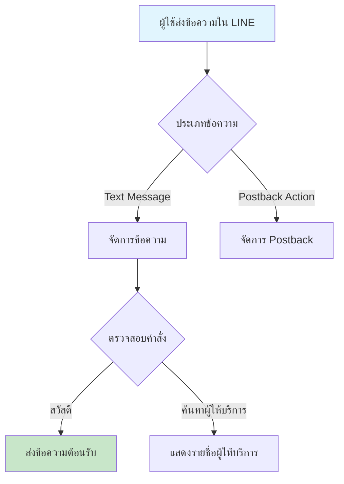

# Test Mermaid Syntax

```mermaid
flowchart TD
    A[ผู้ใช้ส่งข้อความใน LINE] --> B{ประเภทข้อความ}
    B -->|Text Message| C[จัดการข้อความ]
    B -->|Postback Action| D[จัดการ Postback]
    
    C --> E{ตรวจสอบคำสั่ง}
    E -->|สวัสดี| F[ส่งข้อความต้อนรับ]
    E -->|ค้นหาผู้ให้บริการ| G[แสดงรายชื่อผู้ให้บริการ]
    
    style A fill:#e1f5fe
    style F fill:#c8e6c9
```